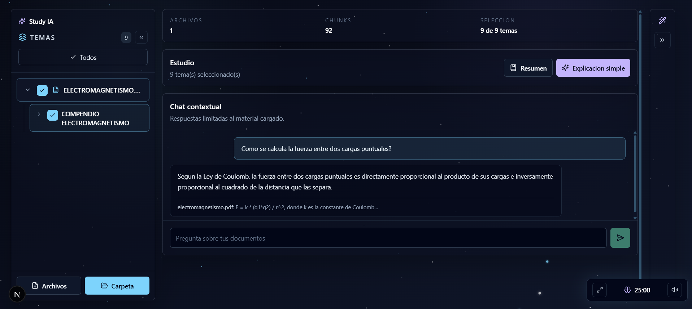

# Project Study IA

Aplicacion web para estudiar con ayuda de inteligencia artificial. Permite cargar documentos locales (PDF, DOCX, TXT, MD), los organiza automaticamente en una jerarquia de Archivo → Tema → Subtema, y ofrece resumenes, explicaciones simples y chat contextual con RAG semantico sobre ese material.

## Demo

**App:** [study-ai-hazel.vercel.app](https://study-ai-hazel.vercel.app/)
**API:** [study-ai-backend-gmd2.onrender.com](https://study-ai-backend-gmd2.onrender.com)

> El backend esta en el plan free de Render: si nadie lo uso en 15 minutos se duerme, y el primer request tarda ~1 minuto en despertarlo. Ademas corre con almacenamiento efimero (ver [Notas sobre el deploy](#notas-sobre-el-deploy-publico)): los documentos subidos pueden perderse si el backend se reinicia.



## Estado Del Proyecto

- Frontend con Next.js, TypeScript, TailwindCSS y Framer Motion.
- Backend con FastAPI.
- Procesamiento de PDF (por tamaño de fuente), DOCX (por estilos) y TXT/MD.
- Deteccion automatica de estructura: Archivo → Tema → Subtema, renderizada como arbol plegable.
- Filtro de temas con IA: ademas del heuristico de deteccion, un paso de IA revisa los titulos detectados y descarta ruido (nombres de autor, tapas, bibliografia, fragmentos cortados) que el heuristico no puede distinguir por si solo.
- RAG con busqueda semantica por embeddings (si el provider activo los soporta) y fallback automatico a busqueda lexica.
- Cadena de fallback entre modelos: si el modelo de IA principal falla o da timeout, reintenta automaticamente con un modelo secundario antes de degradar a modo extractivo.
- Pomodoro flotante, movible y redimensionable.
- Fondo interactivo (canvas animado, no CSS estatico): las estrellas titilan y reaccionan al mouse.
- Identidad anonima por dispositivo (sin login) para poder guardar historial de quizzes por usuario.
- Quiz de opcion multiple generado por IA a partir de un Subtema, con resultados guardados en SQLite.

No incluye autenticacion — ver [Identificacion anonima por dispositivo](#identificacion-anonima-por-dispositivo).

## Highlights tecnicos

Un resumen de los problemas no triviales que aparecieron construyendo esto (mas detalle en los commits):

- **Falsos positivos de tamaño de fuente en PDF**: el heuristico de deteccion de titulos originalmente confundia con miles de "temas" cualquier linea de texto que envolviera visualmente (line-wrap) y, tras el primer fix, cualquier palabra en negrita dentro de un parrafo. La causa raiz: PyMuPDF a veces separa una palabra enfatizada del resto de la linea, y usar el tamaño *maximo* de fuente de esa linea (en vez del minimo) hacia que el parrafo entero se colara como titulo. Se resolvio con tres capas: no correr el heuristico de texto plano sobre PDFs (su extraccion no respeta parrafos), usar el tamaño minimo por linea, y exigir que un titulo candidato empiece con mayuscula.
- **Un modelo LLM entrando en loop de repeticion**: pedirle a un modelo de 550B parametros un booleano por cada uno de 136 temas hacia que se pusiera a repetir `"true, true, true..."` mucho mas alla del input, sin terminar nunca el JSON. La solucion no fue subir el limite de tokens (eso solo tardaba mas y seguia fallando) sino cambiar el contrato: pedirle unicamente los *indices* de los temas invalidos — una respuesta ordenes de magnitud mas corta que termina de forma natural.
- **Cadena de fallback de modelos**: en vez de depender de un unico modelo NIM, el backend prueba un modelo rapido primero y cae automaticamente a uno mas pesado (pero mas confiable) si el primero falla — verificado simulando la falla del modelo primario y confirmando que la respuesta segue siendo correcta.
- **Reconstruccion de jerarquia sin tocar el backend**: el modelo de datos (`Topic.parent_id`) ya soportaba arboles desde antes; renderizar Archivo → Tema → Subtema como un arbol plegable con seleccion en cascada fue puramente un cambio de frontend.

## Identificacion Anonima Por Dispositivo

No hay login. Es una decision de diseño consciente, no un login a medias: el objetivo es que cualquiera pueda probar la demo sin registrarse, con persistencia por navegador/dispositivo para cosas como el historial de quizzes.

Funcionamiento:

- El frontend genera un UUID con `crypto.randomUUID()` la primera vez que carga la app y lo guarda en `localStorage` (`study_ai_user_id`). Ese mismo id se manda en el header `X-User-Id` en **todas** las requests al backend (ver `lib/user-id.ts` y `lib/api.ts`).
- El backend valida el header con una dependencia de FastAPI (`app/core/deps.py`, `get_user_id`): si falta o no es un UUID valido, responde `400`. No hay contraseña ni verificacion de identidad real — es un identificador, no una credencial de autenticacion.
- Ese `user_id` es lo que asocia cada intento de quiz a "quien lo hizo" en la tabla `quiz_attempts` (SQLite), sin necesitar cuentas ni contraseñas.

Limitaciones conocidas (aceptables para una demo, no para produccion real): si el usuario borra `localStorage` o cambia de navegador/dispositivo, pierde su historial — no hay forma de recuperarlo porque no hay cuenta real detras. El header tampoco es una prueba criptografica de identidad: cualquiera podria mandar un UUID ajeno a mano. Para este proyecto ese riesgo es aceptable (no hay datos sensibles ni multiusuario real en juego).

## Stack

### Frontend

- Next.js 16 (App Router)
- TypeScript
- TailwindCSS
- Framer Motion
- lucide-react

### Backend

- Python 3.13
- FastAPI + Uvicorn
- PyMuPDF (extraccion y estructura de PDF)
- python-docx
- OpenAI SDK (cliente compartido para OpenAI, NVIDIA NIM y Ollama, todos OpenAI-compatibles)
- SQLite (`sqlite3` de la stdlib) para el historial de quizzes

### IA y RAG

- Proveedores soportados: OpenAI, NVIDIA NIM, Ollama local, o cualquier endpoint OpenAI-compatible (`OPENAI_BASE_URL`).
- Cadena de fallback: para NIM, se intenta `NIM_MODEL` (rapido) y, si falla, `NIM_FALLBACK_MODEL` (mas pesado).
- Embeddings por chunk al subir un documento, con ranking por similitud coseno; si no hay embeddings disponibles, cae a busqueda lexica.
- Filtro de temas por IA (`filter_valid_topics`) ademas del heuristico de deteccion — ver Highlights tecnicos.

## Arquitectura

```text
study-ai/
|-- frontend/
|   |-- app/
|   |-- components/
|   |-- lib/
|   |-- package.json
|   `-- tailwind.config.ts
|-- backend/
|   |-- app/
|   |   |-- api/
|   |   |-- core/
|   |   |-- models/
|   |   |-- processors/
|   |   `-- services/
|   |-- requirements.txt
|   |-- .python-version
|   `-- .env.example
|-- render.yaml
|-- README.md
`-- .gitignore
```

### Decisiones Importantes

- El frontend no accede directamente al sistema de archivos. Usa inputs de archivo/carpeta del navegador y envia los documentos al backend.
- El backend guarda datos temporales localmente en `backend/storage` (JSON por proyecto), excluido de Git. Los proyectos/documentos no usan una base de datos porque el volumen esperado (uso personal) no lo justifica; los intentos de quiz si usan SQLite (`quiz_attempts`) porque son naturalmente tabulares y se consultan por `user_id`.
- La deteccion de estructura (Archivo/Tema/Subtema) es heuristica y determinista (tamaño de fuente en PDF, estilos en DOCX); la IA solo se usa despues para pulir texto y filtrar ruido, nunca para decidir los limites de un tema — evita depender de un LLM para offsets de caracteres exactos.
- `ai_service.py` centraliza todos los proveedores de IA detras de la misma interfaz OpenAI-compatible. Sin proveedor configurado, el backend responde en modo extractivo (resumenes/respuestas basados en las oraciones mas relevantes del contexto, sin LLM).

## Features

- Subida de multiples archivos o carpeta completa.
- Extraccion de texto y estructura desde PDF, DOCX, TXT/MD.
- Arbol de temas plegable (Archivo → Tema → Subtema) con seleccion en cascada.
- Sidebar y panel de herramientas colapsables (estado persistido).
- Resumen y explicacion simple por seleccion de temas.
- Chat contextual con RAG semantico.
- Quiz de opcion multiple por Subtema, con correccion, explicaciones e historial (panel de herramientas).
- "Actividad reciente" en el panel de herramientas: ultimo resumen/explicacion generado.
- Pomodoro flotante con multiples tecnicas de estudio (Pomodoro, Foco profundo, Flow, Sprint, Micro).
- Fondo animado interactivo (canvas, reacciona al mouse).
- Panel de herramientas: quiz funcional, voz/audio y flashcards como placeholder para features futuras.

## Roadmap

### Fase 1: MVP Base

- [x] Monorepo frontend/backend, UI oscura, carga de archivos, chunking, temas automaticos, resumen/explicacion/chat, Pomodoro.

### Fase 2: RAG Real

- [x] Embeddings por chunk con ranking por similitud coseno y fallback lexico.
- [x] Filtro de temas por IA para descartar ruido que el heuristico no distingue.
- [x] Cadena de fallback entre modelos.
- [ ] Integrar un vector store dedicado (ChromaDB) si el volumen de chunks lo justifica.
- [ ] Citas mas precisas por documento y pagina.

### Fase 3: Mas Formatos

- [ ] PPTX, video (MP4), extraccion de audio (ffmpeg) y transcripcion (Whisper).

### Fase 4: Experiencia De Estudio

- [x] Quiz de opcion multiple por Subtema con historial de intentos (SQLite).
- [ ] Voz y audio, flashcards (el panel de herramientas ya tiene el espacio reservado).
- [ ] Explicacion paso a paso, historial de sesiones, estadisticas mas completas.

## Instalacion Local

### Requisitos

- Node.js 20+
- Python 3.13
- Git

### Backend

```bash
cd backend
python -m venv .venv
```

En Windows PowerShell:

```powershell
.\.venv\Scripts\Activate.ps1
```

En macOS/Linux:

```bash
source .venv/bin/activate
```

Instalar dependencias y correr la API:

```bash
pip install -r requirements.txt
copy .env.example .env
uvicorn app.main:app --reload
```

API en `http://localhost:8000`, health check en `http://localhost:8000/health`.

### Frontend

```bash
cd frontend
npm install
copy .env.example .env.local
npm run dev
```

App en `http://localhost:3000`.

## Variables De Entorno

### Backend

```env
PROJECT_NAME=Project Study IA
API_PREFIX=/api
CORS_ORIGINS=*
STORAGE_DIR=./storage
UPLOAD_DIR=./storage/uploads
PROJECTS_DIR=./storage/projects
DB_PATH=./storage/study_ai.db
AI_PROVIDER=
AI_TIMEOUT_SECONDS=300
OPENAI_API_KEY=
OPENAI_CHAT_MODEL=gpt-4o-mini
OPENAI_BASE_URL=
OLLAMA_BASE_URL=http://localhost:11434
OLLAMA_MODEL=llama3.2
NVIDIA_API_KEY=
NIM_BASE_URL=https://integrate.api.nvidia.com/v1
NIM_MODEL=nvidia/nemotron-3.5-lightning-30b-a3b
NIM_FALLBACK_MODEL=nvidia/nemotron-3-ultra-550b-a55b
NIM_EMBED_MODEL=nvidia/nv-embedqa-e5-v5
OPENAI_EMBED_MODEL=text-embedding-3-small
OLLAMA_EMBED_MODEL=nomic-embed-text
```

`AI_PROVIDER` acepta `openai`, `nim`, `ollama` o vacio (auto-deteccion: OpenAI, despues NIM, despues Ollama, segun que variables esten seteadas).

Para **NVIDIA NIM**: generá una API key en [build.nvidia.com](https://build.nvidia.com) y setea `AI_PROVIDER=nim` + `NVIDIA_API_KEY`. La misma key funciona para cualquier modelo del catalogo (no esta atada a uno solo), asi que se prueba primero `NIM_MODEL` (rapido) y, si falla o tira error, se reintenta automaticamente con `NIM_FALLBACK_MODEL` (mas pesado/lento pero mas confiable) antes de degradar a modo extractivo. Si corres un NIM self-hosted, apunta `NIM_BASE_URL` a tu endpoint y dejá `NVIDIA_API_KEY` vacio.

El mismo provider activo se usa tambien para embeddings (`NIM_EMBED_MODEL` / `OPENAI_EMBED_MODEL` / `OLLAMA_EMBED_MODEL`, sin cadena de fallback — mezclar modelos de embeddings rompe la comparabilidad de los vectores).

### Frontend

```env
NEXT_PUBLIC_API_URL=http://localhost:8000/api
```

## Deploy

Dos servicios independientes: backend en Render, frontend en Vercel.

### Backend (Render)

El repo incluye [`render.yaml`](render.yaml) para un deploy por Blueprint:

1. En Render, **New +** → **Blueprint**, conectá este repo.
2. Render detecta `render.yaml` y crea el servicio (root `backend`, build `pip install -r requirements.txt`, start `uvicorn app.main:app --host 0.0.0.0 --port $PORT`).
3. Cuando pida `NVIDIA_API_KEY`, pegá tu key de [build.nvidia.com](https://build.nvidia.com) (es la unica variable secreta, el resto ya viene seteado en el blueprint).
4. Confirmá que `https://<tu-servicio>.onrender.com/health` responde `{"status":"ok"}`.

Si preferis configurarlo a mano en vez del Blueprint: **New +** → **Web Service**, root directory `backend`, mismos comandos de build/start que arriba, y cargá las variables de [Variables De Entorno](#variables-de-entorno) manualmente.

### Frontend (Vercel)

1. **Add New** → **Project**, importá este repo.
2. **Root Directory**: `frontend` (Vercel detecta Next.js automaticamente).
3. Variable de entorno: `NEXT_PUBLIC_API_URL` = `https://<tu-backend-en-render>.onrender.com/api`.
4. Deploy.

### Notas sobre el deploy publico

- **Almacenamiento efimero**: los proyectos (JSON) y el historial de quizzes (`storage/study_ai.db`, SQLite) viven en el filesystem del contenedor. En Render esto sobrevive entre requests pero se pierde en cada redeploy o reinicio del servicio — esperable para una demo de portfolio, no para produccion real.
- **CORS**: `CORS_ORIGINS=*` es intencional (no hay cookies/credenciales, `allow_credentials=False`), asi que anda sin ajustes. Si queres restringirlo a tu dominio de Vercel, cambia esa variable en Render.
- **Costo/latencia del modelo pesado**: `NIM_FALLBACK_MODEL` (550B parametros) es lento (decenas de segundos a minutos). Solo se usa cuando el modelo rapido falla, pero si tu cuenta de NIM tiene rate limits ajustados, considera sacar el fallback o cambiarlo por uno mas liviano.

## Endpoints Principales

- `POST /api/uploads`: sube archivos y crea/actualiza un proyecto.
- `GET /api/study/{project_id}/topics`: lista temas detectados.
- `POST /api/study/summary`: genera resumen.
- `POST /api/study/simple-explanation`: genera explicacion simple.
- `POST /api/chat`: pregunta al chat contextual.
- `POST /api/quiz/generate`: genera un quiz de opcion multiple para un Subtema.
- `POST /api/quiz/attempts`: guarda el resultado de un intento de quiz.
- `GET /api/quiz/attempts`: lista el historial de intentos del usuario (header `X-User-Id`).

Todos los endpoints requieren el header `X-User-Id` (ver [Identificacion anonima por dispositivo](#identificacion-anonima-por-dispositivo)).

## Estrategia De Ramas

### `main`

Rama estable. Debe representar una version que funciona y se puede mostrar.

### `develop`

Rama de integracion. Aca se juntan features terminadas antes de pasar a `main`.

### `feature/*`

Ramas cortas para funcionalidades concretas.

Ejemplos:

```text
feature/file-upload
feature/document-processing
feature/rag-chat
feature/pomodoro-timer
feature/dark-ui
```

Flujo simple:

```bash
git checkout develop
git checkout -b feature/nombre-de-la-feature

# trabajar y commitear

git checkout develop
git merge feature/nombre-de-la-feature
git branch -d feature/nombre-de-la-feature
```

Cuando `develop` este estable:

```bash
git checkout main
git merge develop
```

## Principios

- Codigo modular y legible.
- MVP funcional antes de optimizaciones.
- Separacion clara entre UI, API, procesamiento, IA y RAG.
- Datos locales fuera de Git.
- Respuestas del chat basadas solamente en documentos cargados.
